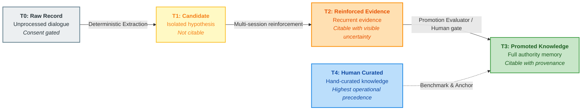
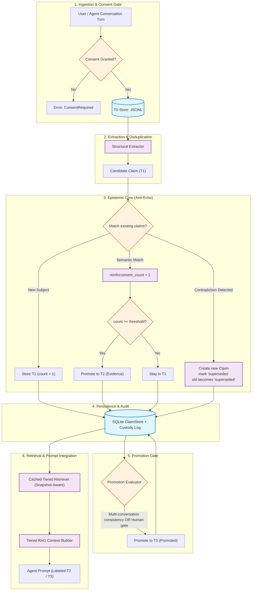
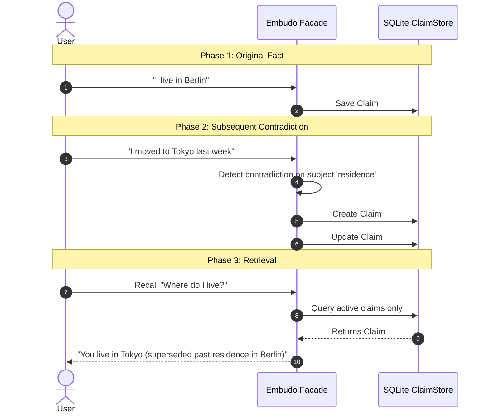

<div align="center">

# 🛡️ EMS — Evidenced Memory System

### A provenance-first memory governance layer for AI agents (Anti-Echo & Local-First)

[](https://www.python.org/)
[](LICENSE)
[]()
[]()
[]()

<br/>

[ **Español** ](README.md) • [ **English Version** ]

</div>

---

> **Most agent memory systems store what was said.**  
> **EMS stores what can be responsibly used.**

```text
Conversation (T0) ➔ Extracted Candidate (T1) ➔ Reinforced Evidence (T2) ➔ Promoted Knowledge (T3)
```

---

## 📑 Table of Contents

- [The Core Problem](#-the-core-problem)
- [Key Features & Guarantees](#-key-features--guarantees)
- [Trust Tiers (T0 – T4)](#-trust-tiers-t0--t4)
- [System Architecture](#-system-architecture)
- [Anti-Echo & Succession Engine](#-anti-echo--succession-engine)
- [Quick Start](#-quick-start)
  - [Installation](#installation)
  - [Python Facade Usage](#python-facade-usage)
  - [CLI Inspection](#cli-inspection)
- [Data Model (`MemoryClaim`)](#-data-model-memoryclaim)
- [Technical Documentation](#-technical-documentation)
- [Positioning](#-positioning)

---

## 🔍 The Core Problem

Standard agent architectures suffer from **conversational echo loops**:
1. An unverified claim or hallucination is uttered during a dialogue.
2. The agent commits it directly to a vector store as an absolute truth.
3. In subsequent turns, the agent retrieves its own past output and treats it as external fact.
4. Over time, error amplifies, and knowledge corrupts.

**EMS breaks this loop.** In EMS, conversational input is treated strictly as raw, non-citable material. For a claim to gain epistemic authority, it must advance through a tiered pipeline of multi-session reinforcement, contradiction resolution, consistency evaluation, and temporal decay.

---

## 🛡️ Key Features & Guarantees

- 🏷️ **Tiered Trust (T0–T4)**: Strict separation between raw chat, extracted hypotheses, reinforced empirical evidence, and promoted knowledge.
- 🔗 **Immutable Provenance**: Every claim preserves its custody chain and source conversation IDs.
- 🔀 **Explicit Succession (Append-Only)**: Nothing is silently overwritten. Contradictions generate explicit `supersedes` / `superseded_by` links.
- ⏳ **Temporal Decay**: Knowledge not reconfirmed loses weight over configurable half-lives.
- 🔒 **Consent-First**: Zero egress by default. Processing conversation logs strictly requires user authorization before touching disk.
- ⚡ **Local-First & Resilient**: SQLite in WAL mode, JSONL source storage, and snapshot-invalidated cache retrievers.

---

## 📊 Trust Tiers (T0 – T4)



| Tier | Name | Nature | Can it be cited as fact? | Integration in Prompt |
|:---:|:---|:---|:---:|:---|
| **T0** | **Raw Conversation** | Unprocessed dialogue stream with explicit consent. | ❌ **No** | Excluded from RAG retrieval context. |
| **T1** | **Extracted Candidate** | Explicit statement extracted structurally from a single session. | ❌ **No** | Under observation. Never cited to the agent. |
| **T2** | **Reinforced Evidence** | Candidate validated across multiple distinct sessions. | ⚠️ **With Uncertainty** | Injected with explicit uncertainty tags (`[EVIDENCIA T2]`). |
| **T3** | **Promoted Knowledge** | Passed strict multi-session promotion evaluator or human approval. | ✅ **Yes** | Injected with full authority and origin hash. |
| **T4** | **Human Curated Source** | Verified enterprise documentation or human-edited truth. | ✅ **Highest Authority** | Always takes precedence in case of conflict. |

---

## 🏛️ System Architecture



---

## 🔄 Anti-Echo & Succession Engine



---

## 🚀 Quick Start

### Installation

```bash
git clone https://github.com/YoxeLaunch/EMS-Evidenced-Memory-System.git
cd EMS-Evidenced-Memory-System
pip install -e .
```

### Python Facade Usage

```python
from datetime import datetime, timezone
from embudo import Embudo
from memory.capture import Turn, Consent

# 1. Open persistent local memory store
with Embudo.open("memory.db") as memory:
    now_iso = datetime.now(timezone.utc).isoformat()
    
    # 2. Register conversation turn with explicit user consent
    consent = Consent(
        granted=True,
        scope="profile_and_preferences",
        user_id="user_123",
        timestamp=now_iso
    )
    
    record, claims = memory.register_conversation(
        turns=[
            Turn(speaker="user", text="I am severely allergic to penicillin.", timestamp=now_iso)
        ],
        agent_id="medical_agent",
        user_id="user_123",
        consent=consent
    )
    
    print(f"Captured record ID: {record.id}")
    for c in claims:
        print(f"Claim [{c.tier.value}]: {c.subject} -> {c.text}")

    # 3. Retrieve tiered context for LLM prompt
    context = memory.recall("penicillin allergy", agent_id="medical_agent")
    
    # Inject into prompt
    print("\n--- Tiered Prompt Block ---")
    print(context.as_prompt_block())
```

### CLI Inspection

```bash
# View memory database statistics and custody metrics
embudo stats memory.db
```

Output:
```text
Embudo v0.2.0 — memory.db
esquema: v2
claims activos: 14 (T1: 4, T2: 8, T3: 2)
estados: active: 14, superseded: 3, expired: 1
eventos de custodia: created: 18, reinforced: 9, superseded: 3, promoted: 2
conversaciones T0: 12
construcciones de índice: 4
```

---

## 🧱 Data Model (`MemoryClaim`)

```python
@dataclass(frozen=True)
class MemoryClaim:
    id: str                        # Deterministic hash of (agent_id, subject, normalized_text)
    agent_id: str                  # Isolated namespace / agent identifier
    subject: str                   # Normalized topic or entity (for indexing and deduplication)
    text: str                      # Stored claim in normalized canonical form
    tier: Tier                     # T0 | T1 | T2 | T3
    confidence: float              # Tier-specific internal score (0.0 to 1.0)
    source_conversation_ids: list  # Full provenance tracking back to T0 logs
    first_seen_at: str             # ISO timestamp of first capture
    last_reinforced_at: str        # ISO timestamp of latest reinforcement
    reinforcement_count: int       # Number of independent session confirmations
    supersedes: str | None         # ID of past claim invalidated by this one
    superseded_by: str | None      # ID of successor claim if invalidated
    decay_half_life_days: int      # Half-life duration before confidence decay
    status: ClaimStatus            # active | superseded | expired | rejected
```

---

## 📚 Technical Documentation

- 📖 [**00 - Vision and Architecture**](docs/00-VISION-Y-ARQUITECTURA.md): Epistemic design principles, anti-echo guarantees, and comparison with static wiki systems.
- ⚙️ [**01 - Tiered Memory Technical Core**](docs/01-MEMORIA-NIVELADA.md): Mathematical formulations for reinforcement, decay half-life, and promotion criteria.
- 🧩 [**02 - Modular Components**](docs/02-COMPONENTES-REUTILIZABLES.md): In-depth breakdown of RAG, providers, and storage layers.
- 🗺️ [**03 - Project Roadmap**](docs/03-ROADMAP.md): Development milestones and production validation criteria.
- 🤝 [**Collaboration Log**](COLABORACION.md): Architectural decisions log, invariant checkpoints, and design rationale.

---

## 💡 Positioning

> **"An LLM's confidence is never evidence."**  
> **"Contradictions create succession, not silent overwrites."**

EMS is not a chatbot memory feature. It is a **Memory Governance System for AI Agents**: a reusable layer between conversation, semantic retrieval, human-curated knowledge, and long-term learning.

---

<div align="center">
  <sub>Built for agents that learn from experience without mistaking repetition for truth.</sub>
</div>
