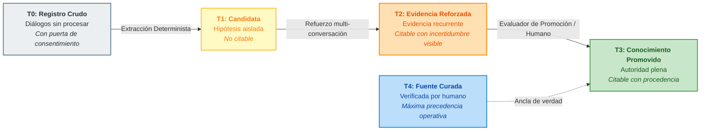
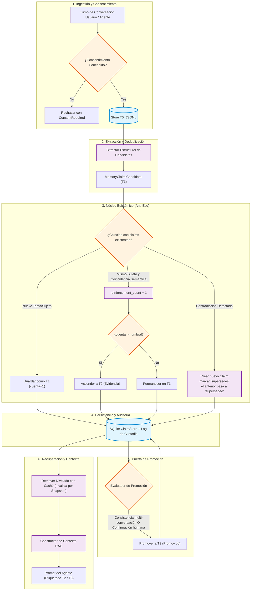
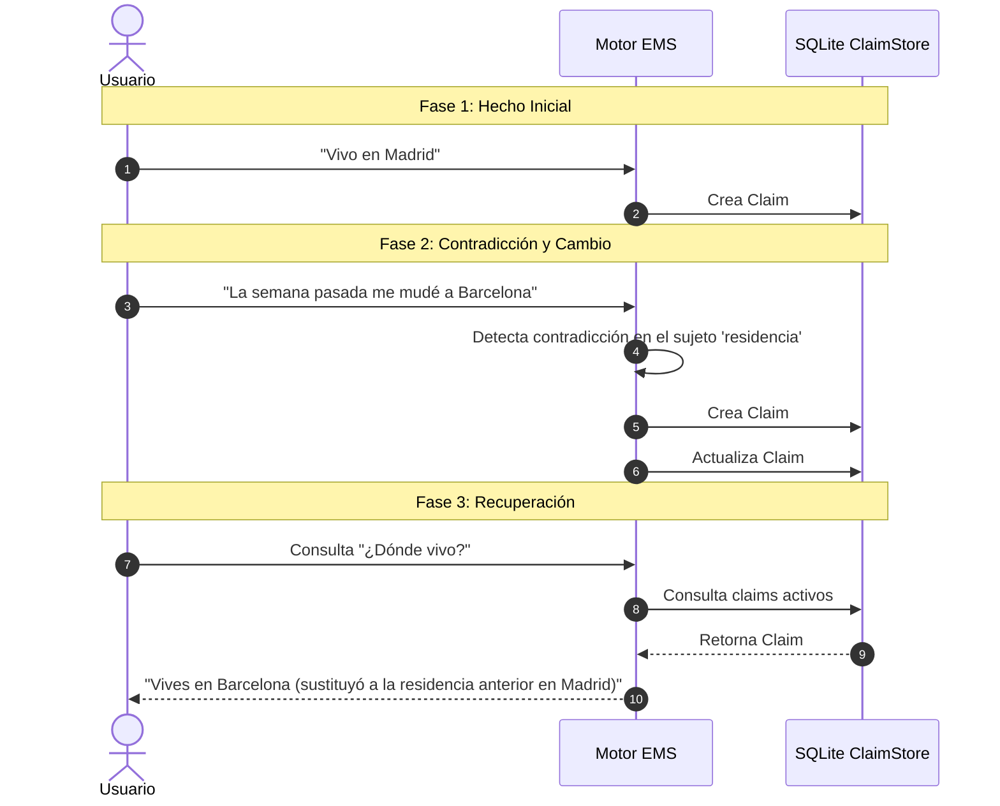

# EMS — Sistema de Memoria Basada en Evidencia (Evidenced Memory System)

[](https://www.python.org/downloads/)
[]()
[]()
[]()
[](LICENSE)

[ **English** ](README.md) | [ **Español** ]

> **Una capa de gobernanza de memoria con procedencia verificable para agentes de IA.**  
> *La mayoría de sistemas de memoria guardan lo que se dijo. EMS guarda lo que un agente puede usar responsablemente.*

```text
Conversación (T0) → Candidata Extraída (T1) → Evidencia Reforzada (T2) → Conocimiento Promovido (T3)
```

---

## 📑 Tabla de Contenidos

- [El Problema Central](#-el-problema-central)
- [Características y Garantías Principales](#-características-y-garantías-principales)
- [Niveles de Confianza (T0 – T4)](#-niveles-de-confianza-t0--t4)
- [Arquitectura del Sistema](#-arquitectura-del-sistema)
- [Flujo de Datos y Ciclo de Vida](#-flujo-de-datos-y-ciclo-de-vida)
- [Motor Anti-Eco y Sucesión Temporal](#-motor-anti-eco-y-sucesión-temporal)
- [Guía de Inicio Rápido](#-guía-de-inicio-rápido)
  - [Instalación](#instalación)
  - [Ejemplo de Uso de la API en Python](#ejemplo-de-uso-de-la-api-en-python)
  - [Herramienta CLI](#herramienta-cli)
- [Modelo de Datos (`MemoryClaim`)](#-modelo-de-datos-memoryclaim)
- [Índice de Documentación](#-índice-de-documentación)
- [Filosofía y Posicionamiento](#-filosofía-y-posicionamiento)

---

## 🔍 El Problema Central

Las arquitecturas de memoria tradicionales para agentes sufren del fenómeno del **bucle de eco**:
1. Una afirmación no verificada o una alucinación surge durante una conversación.
2. El agente la guarda directamente en su base de datos vectorial como un hecho absoluto.
3. En interacciones posteriores, el agente recupera su propia declaración pasada y la trata como una verdad externa irrefutable.
4. Con el tiempo, el error se amplifica y el conocimiento del agente se corrompe.

**EMS elimina este bucle de raíz.** En EMS, lo conversado es tratado estrictamente como materia prima. Una afirmación debe ganarse la confianza epistémica mediante refuerzo entre múltiples sesiones independientes, resolución explícita de contradicciones, validación temporal de caducidad y filtros de promoción antes de poder ser citada como un hecho.

---

## 🛡️ Características y Garantías Principales

- 🏷️ **Confianza por Niveles (T0–T4)**: Separación estricta entre diálogo crudo, hipótesis extraídas, evidencia reforzada, conocimiento promovido y fuentes curadas por humanos.
- 🔗 **Procedencia y Custodia por Defecto**: Cada memoria mantiene trazabilidad completa e inmutable hacia las conversaciones de origen y sus eventos de custodia.
- 🔀 **Historial Append-Only (Diseño Anti-Eco)**: Las contradicciones nunca sobreescriben datos en silencio; crean relaciones explícitas de sucesión (`supersedes` / `superseded_by`).
- ⏳ **Validez Temporal y Caducidad**: El conocimiento que no se reconfirma con el tiempo pierde peso mediante vidas medias configurables.
- 🔒 **Consentimiento Obligatorio y Privacidad**: Denegación de salida de datos por defecto. El registro de diálogos exige consentimiento explícito del usuario antes de tocar disco.
- ⚡ **Local-First y Resiliente**: Núcleo determinista sobre SQLite (modo WAL) y almacenamiento JSONL, con índices cacheados e invalidados por snapshot. Cero dependencias forzadas de servicios en la nube.

---

## 📊 Niveles de Confianza (T0 – T4)



| Nivel | Nombre | Naturaleza | ¿Se puede citar como hecho? | Presentación en el Prompt del Agente |
|:---:|:---|:---|:---:|:---|
| **T0** | **Registro Crudo** | Flujo de diálogo sin procesar con consentimiento explícito. | ❌ **No** | Excluido de la recuperación RAG. Solo entrada de datos. |
| **T1** | **Candidata Extraída** | Afirmación extraída estructuralmente de una sola mención. | ❌ **No** | En observación. Nunca se inyecta como contexto citable. |
| **T2** | **Evidencia Reforzada** | Candidata validada en múltiples sesiones independientes. | ⚠️ **Con Incertidumbre** | Inyectada con etiquetas explícitas (ej. `[EVIDENCIA T2]`). |
| **T3** | **Conocimiento Promovido** | Superó el evaluador de consistencia o validación humana. | ✅ **Sí** | Inyectada con autoridad plena, hash y procedencia. |
| **T4** | **Fuente Curada por Humano** | Documentación oficial o verdad editada manualmente. | ✅ **Máxima Autoridad** | Siempre tiene precedencia ante cualquier conflicto. |

---

## 🏛️ Arquitectura del Sistema



---

## 🔄 Motor Anti-Eco y Sucesión Temporal

Cuando la realidad cambia (por ejemplo: *"Trabajo en la Empresa A"* y semanas después *"Renuncié y ahora trabajo en la Empresa B"*), las bases vectoriales convencionales mezclan ambas afirmaciones generando confusión.

EMS implementa **Sucesión Explícita**:



> 💡 **Invariante Central**: Nada se sobreescribe en silencio. El historial es append-only y completamente auditable.

---

## 🚀 Guía de Inicio Rápido

### Instalación

```bash
git clone https://github.com/YoxeLaunch/EMS-Evidenced-Memory-System.git
cd EMS-Evidenced-Memory-System
pip install -e .
```

### Ejemplo de Uso de la API en Python

```python
from datetime import datetime, timezone
from embudo import Embudo
from memory.capture import Turn, Consent

# 1. Abrir base de datos de memoria persistente (SQLite + JSONL)
with Embudo.open("memoria_agente.db") as memoria:
    ahora_iso = datetime.now(timezone.utc).isoformat()
    
    # 2. Registrar turno conversacional con consentimiento explícito obligatorio
    consentimiento_usuario = Consent(
        granted=True,
        scope="perfil_y_preferencias",
        user_id="usuario_123",
        timestamp=ahora_iso
    )
    
    registro, claims = memoria.register_conversation(
        turns=[
            Turn(speaker="user", text="Soy alérgico a la penicilina.", timestamp=ahora_iso)
        ],
        agent_id="asistente_medico",
        user_id="usuario_123",
        consent=consentimiento_usuario
    )
    
    print(f"ID de registro capturado: {registro.id}")
    for c in claims:
        print(f"Claim extraído [{c.tier.value}]: {c.subject} -> {c.text}")

    # 3. Recuperar contexto clasificado por nivel para el prompt del LLM
    contexto = memoria.recall("alergia a medicamentos", agent_id="asistente_medico")
    
    # Inyectar directamente en el prompt
    print("\n--- Bloque formateado para el Prompt ---")
    print(contexto.as_prompt_block())
```

### Herramienta CLI

EMS incluye una interfaz de línea de comandos para auditar el estado y salud de la memoria:

```bash
# Inspeccionar estadísticas, claims activos y eventos de custodia
embudo stats memoria_agente.db
```

Salida esperada:
```text
Embudo v0.2.0 — memoria_agente.db
esquema: v2
claims activos: 14 (T1: 4, T2: 8, T3: 2)
estados: active: 14, superseded: 3, expired: 1
eventos de custodia: created: 18, reinforced: 9, superseded: 3, promoted: 2
conversaciones T0: 12
construcciones de índice: 4
```

---

## 🧱 Modelo de Datos (`MemoryClaim`)

```python
@dataclass(frozen=True)
class MemoryClaim:
    id: str                        # Hash SHA-256 determinista de (agent_id, subject, texto_normalizado)
    agent_id: str                  # Espacio de nombres / identificador del agente
    subject: str                   # Entidad o tema normalizado (para deduplicación e indexado)
    text: str                      # Afirmación almacenada en forma canónica normalizada
    tier: Tier                     # T0 | T1 | T2 | T3
    confidence: float              # Puntuación de confianza interna del nivel (0.0 a 1.0)
    source_conversation_ids: list  # Trazabilidad completa hacia los registros T0 originales
    first_seen_at: str             # Marca de tiempo ISO de la primera captura
    last_reinforced_at: str        # Marca de tiempo ISO del último refuerzo
    reinforcement_count: int       # Número de confirmaciones en sesiones independientes
    supersedes: str | None         # ID del claim histórico que este reemplaza
    superseded_by: str | None      # ID del claim sucesor si fue invalidado
    decay_half_life_days: int      # Vida media en días antes de iniciar pérdida de confianza
    status: ClaimStatus            # active | superseded | expired | rejected
```

---

## 📚 Índice de Documentación

Explora en profundidad la visión arquitectónica, modelos epistémicos y registros de diseño:

- 📖 [**Visión y Arquitectura**](docs/00-VISION-Y-ARQUITECTURA.md): Principios epistémicos, garantías anti-eco y comparación con sistemas de wiki estática.
- ⚙️ [**Memoria Nivelada — Núcleo Técnico**](docs/01-MEMORIA-NIVELADA.md): Fórmulas de refuerzo, vidas medias de caducidad y criterios de promoción.
- 🧩 [**Componentes Reutilizables y Modulares**](docs/02-COMPONENTES-REUTILIZABLES.md): Detalle técnico de las capas RAG, proveedores de modelos y persistencia.
- 🗺️ [**Roadmap del Proyecto**](docs/03-ROADMAP.md): Hitos, fases implementadas y criterios de validación en entornos reales.
- 🤝 [**Registro de Decisiones y Colaboración**](COLABORACION.md): Bitácora de decisiones arquitectónicas, puntos de control e invariantes de diseño.

---

## 💡 Filosofía y Posicionamiento

> **"La confianza de un LLM nunca es evidencia."**  
> **"Las contradicciones crean sucesión, no sobrescrituras silenciosas."**

EMS no es una simple función de memoria para chatbots ni una caché clave-valor ingenua. Es un **Sistema de Gobernanza de Memoria para Agentes de IA**: una capa estructurada y determinista entre el diálogo conversacional, la recuperación vectorial, el conocimiento curado y el aprendizaje continuo a largo plazo.

---

<div align="center">
  <sub>Construido con estándares epistémicos rigurosos para agentes que aprenden de la experiencia sin confundir repetición con verdad.</sub>
</div>
