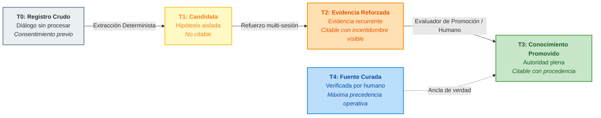
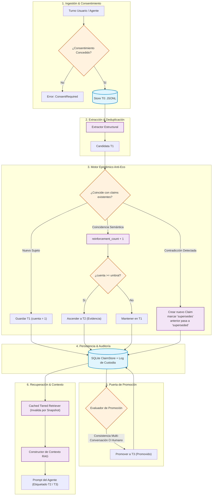
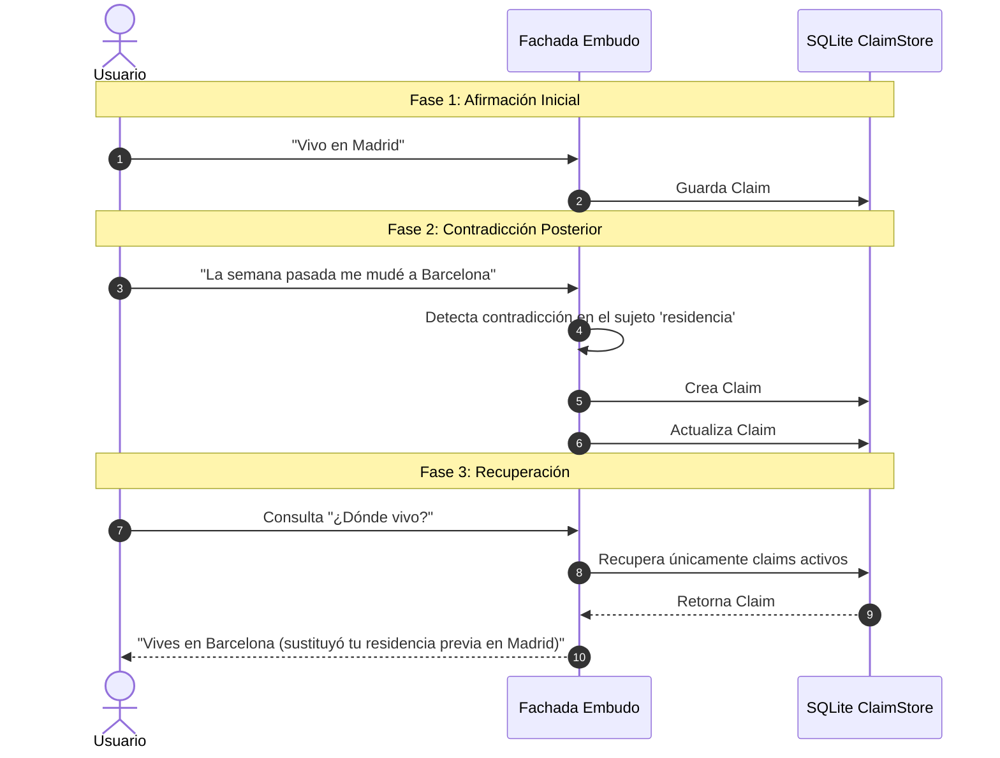

<div align="center">

# 🛡️ EMS — Evidenced Memory System

### Capa de gobernanza de memoria y procedencia verificable para agentes de IA (Anti-Eco & Local-First)

[](https://www.python.org/)
[](LICENSE)
[]()
[]()
[]()

<br/>

[ **Español** ] • [ **English Version** ](README.en.md)

</div>

---

> **La mayoría de sistemas de memoria guardan lo que se dijo.**  
> **EMS guarda lo que un agente puede usar responsablemente.**

```text
Conversación (T0) ➔ Candidata Extraída (T1) ➔ Evidencia Reforzada (T2) ➔ Conocimiento Promovido (T3)
```

---

## 📑 Tabla de Contenidos

- [El Problema que Resuelve](#-el-problema-que-resuelve)
- [Garantías Centrales y Principios](#-garantías-centrales-y-principios)
- [Niveles de Confianza (T0 – T4)](#-niveles-de-confianza-t0--t4)
- [Arquitectura del Sistema](#-arquitectura-del-sistema)
- [Motor Anti-Eco y Sucesión Temporal](#-motor-anti-eco-y-sucesión-temporal)
- [Guía de Inicio Rápido](#-guía-de-inicio-rápido)
  - [Instalación](#instalación)
  - [Uso con la Fachada Python](#uso-con-la-fachada-python)
  - [Inspección con CLI](#inspección-con-cli)
- [Modelo de Datos (`MemoryClaim`)](#-modelo-de-datos-memoryclaim)
- [Documentación Técnica](#-documentación-técnica)
- [Posicionamiento](#-posicionamiento)

---

## 🔍 El Problema que Resuelve

Las memorias conversacionales convencionales sufren del **bucle de eco**:
1. Una afirmación no verificada surge durante un diálogo.
2. El agente la almacena directamente en un vector store como verdad absoluta.
3. En turnos posteriores, el agente recupera su propia salida pasada y la asume como hecho externo irrefutable.
4. Con el tiempo, el error se amplifica y el conocimiento del agente se corrompe.

**EMS previene este bucle.** Lo conversado es tratado estrictamente como materia prima no citable. Para que una afirmación adquiera autoridad, debe ascender por un pipeline epistémico de refuerzo en múltiples sesiones independientes, resolución de contradicciones, evaluación de consistencia y caducidad temporal.

---

## 🛡️ Garantías Centrales y Principios

- 🏷️ **Confianza Nivelada (T0–T4)**: Separación estricta entre el log crudo, hipótesis extraídas, evidencia empírica reforzada y conocimiento promovido.
- 🔗 **Procedencia Inmutable**: Cada afirmación preserva su cadena de custodia e IDs de las conversaciones de origen.
- 🔀 **Sucesión Explícita (Append-Only)**: Nada se sobreescribe en silencio. Las contradicciones generan relaciones `supersedes` / `superseded_by`.
- ⏳ **Caducidad Temporal**: El conocimiento no reconfirmado pierde peso según vidas medias configurables.
- 🔒 **Consentimiento Obligatorio**: Denegación de salida de datos por defecto. Ningún turno se procesa sin autorización previa.
- ⚡ **Local-First y Resiliente**: SQLite en modo WAL, almacenamiento plano JSONL para T0, y caché de recuperación invalidada por snapshot de base de datos.

---

## 📊 Niveles de Confianza (T0 – T4)



| Nivel | Nombre | Naturaleza | ¿Se puede citar como hecho? | Integración en Prompt |
|:---:|:---|:---|:---:|:---|
| **T0** | **Registro Crudo** | Diálogo crudo persistido con consentimiento explícito. | ❌ **No** | Excluido de la recuperación RAG. |
| **T1** | **Candidata Extraída** | Afirmación detectada en una sola sesión. | ❌ **No** | En observación interna. Nunca citada al usuario. |
| **T2** | **Evidencia Reforzada** | Afirmación validada en múltiples conversaciones distintas. | ⚠️ **Con Incertidumbre** | Inyectada con etiquetas de advertencia (`[EVIDENCIA T2]`). |
| **T3** | **Conocimiento Promovido** | Superó el evaluador de consistencia o validación humana. | ✅ **Sí** | Inyectada con autoridad plena y hash de procedencia. |
| **T4** | **Fuente Curada** | Documentación o verdad ingresada manualmente por un humano. | ✅ **Máxima Precedencia** | Prevalece ante cualquier conflicto. |

---

## 🏛️ Arquitectura del Sistema



---

## 🔄 Motor Anti-Eco y Sucesión Temporal

Cuando la información del mundo real cambia, EMS aplica **Sucesión Explícita** en lugar de sobreescritura destructiva:



---

## 🚀 Guía de Inicio Rápido

### Instalación

```bash
git clone https://github.com/YoxeLaunch/EMS-Evidenced-Memory-System.git
cd EMS-Evidenced-Memory-System
pip install -e .
```

### Uso con la Fachada Python

```python
from datetime import datetime, timezone
from embudo import Embudo
from memory.capture import Turn, Consent

# 1. Abrir la base de datos de memoria persistente
with Embudo.open("memoria.db") as memoria:
    ahora = datetime.now(timezone.utc).isoformat()
    
    # 2. Registrar turno con consentimiento explícito del usuario
    consentimiento = Consent(
        granted=True,
        scope="perfil_y_preferencias",
        user_id="usuario-1",
        timestamp=ahora
    )
    
    record, claims = memoria.register_conversation(
        turns=[
            Turn(speaker="user", text="Soy alérgico a la penicilina.", timestamp=ahora)
        ],
        agent_id="dr_soma",
        user_id="usuario-1",
        consent=consentimiento
    )
    
    print(f"ID conversación registrada: {record.id}")
    for c in claims:
        print(f"Claim [{c.tier.value}]: {c.subject} -> {c.text}")

    # 3. Recuperar contexto clasificado para el LLM
    contexto = memoria.recall("alergias del paciente", agent_id="dr_soma")
    
    # Inyectar en el prompt
    print("\n--- Bloque RAG Nivelado ---")
    print(contexto.as_prompt_block())
```

### Inspección con CLI

```bash
# Ver métricas de salud, claims activos y eventos de custodia
embudo stats memoria.db
```

Salida:
```text
Embudo v0.2.0 — memoria.db
esquema: v2
claims activos: 14 (T1: 4, T2: 8, T3: 2)
estados: active: 14, superseded: 3, expired: 1
eventos de custodia: created: 18, reinforced: 9, superseded: 3, promoted: 2
conversaciones T0: 12
construcciones de índice: 4
```

---

## 🧱 Modelo de Datos (`MemoryClaim`)

```python
@dataclass(frozen=True)
class MemoryClaim:
    id: str                        # Hash determinista de (agent_id, subject, texto_normalizado)
    agent_id: str                  # Espacio de nombres / identificador del agente
    subject: str                   # Entidad o tema normalizado (para indexado y deduplicación)
    text: str                      # Afirmación almacenada en forma canónica
    tier: Tier                     # T0 | T1 | T2 | T3
    confidence: float              # Puntuación interna de confianza (0.0 a 1.0)
    source_conversation_ids: list  # Trazabilidad completa hacia los registros T0 originales
    first_seen_at: str             # Marca de tiempo de primera captura
    last_reinforced_at: str        # Marca de tiempo del último refuerzo
    reinforcement_count: int       # Conteo de confirmaciones en sesiones independientes
    supersedes: str | None         # ID de la afirmación anterior reemplazada por esta
    superseded_by: str | None      # ID de la afirmación sucesora si fue invalidada
    decay_half_life_days: int      # Vida media en días antes de iniciar pérdida de peso
    status: ClaimStatus            # active | superseded | expired | rejected
```

---

## 📚 Documentación Técnica

- 📖 [**00 - Visión y Arquitectura**](docs/00-VISION-Y-ARQUITECTURA.md): Motivación, filosofía epistémica y principios de diseño anti-eco.
- ⚙️ [**01 - Memoria Nivelada**](docs/01-MEMORIA-NIVELADA.md): Núcleo técnico: captura, extracción, refuerzo, promoción y caducidad.
- 🧩 [**02 - Componentes Reutilizables**](docs/02-COMPONENTES-REUTILIZABLES.md): Arquitectura modular, RAG, almacenamiento y proveedores.
- 🗺️ [**03 - Roadmap del Proyecto**](docs/03-ROADMAP.md): Fases del desarrollo y criterios de validación.
- 🤝 [**Bitácora de Colaboración**](COLABORACION.md): Registro de decisiones técnicas y puntos de control.

---

## 💡 Posicionamiento

> **"La confianza de un LLM nunca es evidencia."**  
> **"Las contradicciones crean sucesión, no sobrescrituras silenciosas."**

EMS no es una simple función de memoria para chatbots. Es un **sistema de gobernanza de memoria para agentes de IA**: una capa reutilizable entre la conversación, la recuperación semántica, el conocimiento curado por humanos y el aprendizaje a largo plazo.

---

<div align="center">
  <sub>Construido para agentes que aprenden de la experiencia sin confundir repetición con verdad.</sub>
</div>
