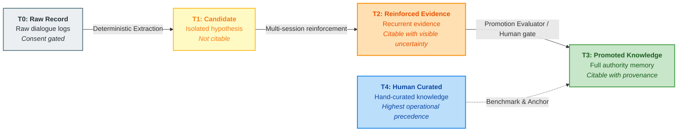
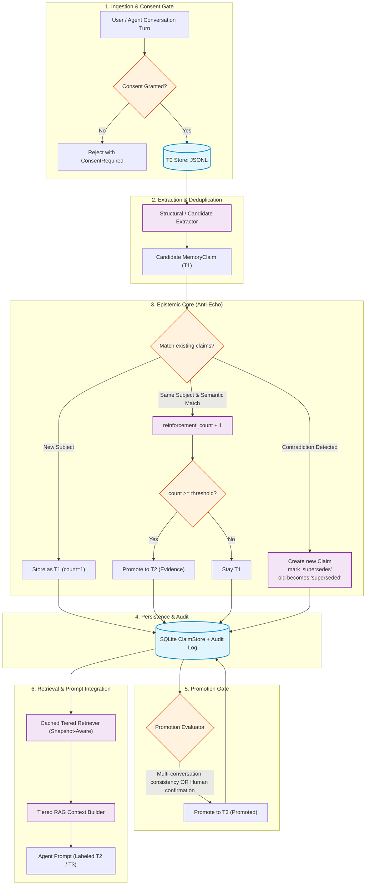
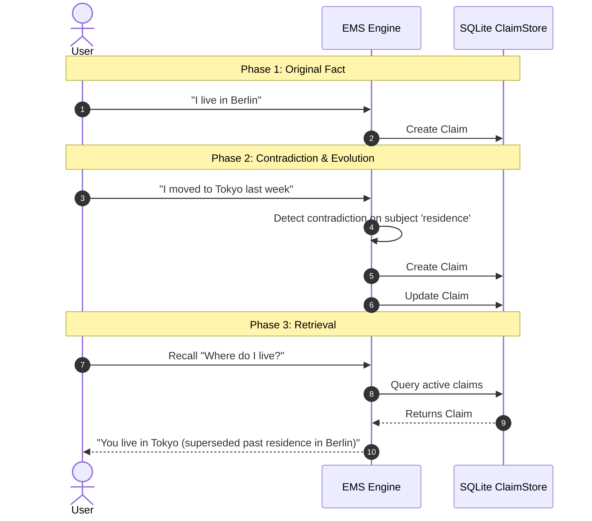

# EMS — Evidenced Memory System

[](https://www.python.org/downloads/)
[]()
[]()
[]()
[](LICENSE)

[ **English** ] | [ **Español** ](README.es.md)

> **A provenance-first memory layer for AI agents.**  
> *Most agent memory systems store what was said. EMS stores what can be responsibly used.*

```text
Conversation (T0) → Extracted Candidate (T1) → Reinforced Evidence (T2) → Promoted Knowledge (T3)
```

---

## 📑 Table of Contents

- [The Core Problem](#-the-core-problem)
- [Key Features & Guarantees](#-key-features--guarantees)
- [Trust Tiers (T0 – T4)](#-trust-tiers-t0--t4)
- [System Architecture](#-system-architecture)
- [Data Flow & Lifecycle](#-data-flow--lifecycle)
- [Anti-Echo & Succession Engine](#-anti-echo--succession-engine)
- [Quick Start](#-quick-start)
  - [Installation](#installation)
  - [Python API Example](#python-api-example)
  - [CLI Tool](#cli-tool)
- [Data Model (`MemoryClaim`)](#-data-model-memoryclaim)
- [Documentation Index](#-documentation-index)
- [Philosophy & Positioning](#-philosophy--positioning)

---

## 🔍 The Core Problem

Standard agent architectures suffer from **conversational echo loops**:
1. An unverified claim or hallucination is uttered during a dialogue.
2. The agent commits it directly to a vector store as an absolute truth.
3. In subsequent turns, the agent retrieves its own past output and treats it as external fact.
4. Over time, error amplifies, and knowledge corrupts.

**EMS breaks this loop.** In EMS, conversational input is treated strictly as raw material. Claims must earn epistemic trust through multi-session reinforcement, contradiction resolution, temporal validation, and explicit gate promotion before they can ever be cited as facts.

---

## 🛡️ Key Features & Guarantees

- 🏷️ **Tiered Trust (T0–T4)**: Strict separation between raw chat, extracted hypotheses, reinforced evidence, promoted knowledge, and human ground-truth.
- 🔗 **Provenance & Custody by Default**: Every claim maintains cryptographic-like lineage to its original conversation IDs and mutation events.
- 🔀 **Append-Only Succession (Anti-Echo)**: Contradictory statements never overwrite data silently; they create explicit `supersedes` / `superseded_by` relationships.
- ⏳ **Temporal Validity & Decay**: Knowledge that is not periodically reconfirmed decays in confidence over configurable half-lives.
- 🔒 **Consent-First & Privacy**: Zero egress by default. Processing conversation logs strictly requires user consent gates before touching disk.
- ⚡ **Local-First & Resilient**: Built on deterministic core logic, SQLite with WAL mode, JSONL source storage, and snapshot-invalidated cache retrievers. Zero required cloud dependencies.

---

## 📊 Trust Tiers (T0 – T4)



| Tier | Name | Nature | Can it be cited as fact? | Retrieval Context Presentation |
|:---:|:---|:---|:---:|:---|
| **T0** | **Raw Conversation** | Unprocessed dialogue stream with explicit user consent. | ❌ **No** | Excluded from RAG retrieval context. Raw input only. |
| **T1** | **Extracted Candidate** | Explicit statements extracted structurally. Single occurrence. | ❌ **No** | Under observation. Never cited to the agent. |
| **T2** | **Reinforced Evidence** | Candidate validated across multiple distinct sessions or explicit feedback. | ⚠️ **With Uncertainty** | Injected with explicit confidence badges (e.g. `[EVIDENCIA T2]`). |
| **T3** | **Promoted Knowledge** | Passed strict multi-session promotion evaluator or human approval. | ✅ **Yes** | Injected with full authority and origin hash. |
| **T4** | **Human Curated Source** | Verified enterprise documentation or human-edited truth. | ✅ **Highest Authority** | Always takes precedence in case of conflict. |

---

## 🏛️ System Architecture



---

## 🔄 Anti-Echo & Succession Engine

When real-world facts change (e.g., *"I work at Company A"* followed weeks later by *"I resigned and joined Company B"*), standard vector memories blend both into confused embeddings. 

EMS enforces **Explicit Succession**:



> 💡 **Core Invariant**: Nothing is silently overwritten. History is append-only and fully auditable.

---

## 🚀 Quick Start

### Installation

```bash
git clone https://github.com/YoxeLaunch/EMS-Evidenced-Memory-System.git
cd EMS-Evidenced-Memory-System
pip install -e .
```

### Python API Example

```python
from datetime import datetime, timezone
from embudo import Embudo
from memory.capture import Turn, Consent

# 1. Open local memory database (SQLite + JSONL)
with Embudo.open("agent_memory.db") as memory:
    now_iso = datetime.now(timezone.utc).isoformat()
    
    # 2. Register conversation turn with mandatory user consent
    user_consent = Consent(
        granted=True,
        scope="profile_and_preferences",
        user_id="user_123",
        timestamp=now_iso
    )
    
    record, claims = memory.register_conversation(
        turns=[
            Turn(speaker="user", text="I am severely allergic to penicillin.", timestamp=now_iso)
        ],
        agent_id="medical_assistant",
        user_id="user_123",
        consent=user_consent
    )
    
    print(f"Captured record ID: {record.id}")
    for c in claims:
        print(f"Extracted claim [{c.tier.value}]: {c.subject} -> {c.text}")

    # 3. Retrieve tiered context for LLM prompt
    context = memory.recall("penicillin allergy", agent_id="medical_assistant")
    
    # Inject directly into your LLM prompt
    print("\n--- LLM Prompt Block ---")
    print(context.as_prompt_block())
```

### CLI Tool

EMS provides an integrated CLI to inspect memory store health and custody metrics:

```bash
# View database statistics, active claims, and audit events
embudo stats agent_memory.db
```

Output:
```text
Embudo v0.2.0 — agent_memory.db
esquema: v2
claims activos: 14 (T1: 4, T2: 8, T3: 2)
estados: active: 14, superseded: 3, expired: 1
eventos de custodia: created: 18, reinforced: 9, superseded: 3, promoted: 2
conversaciones T0: 12
construcciones de índice: 4
```

---

## 🧱 Data Model (`MemoryClaim`)

```python
@dataclass(frozen=True)
class MemoryClaim:
    id: str                        # Deterministic SHA-256 hash of (agent_id, subject, normalized_text)
    agent_id: str                  # Isolated namespace / agent identifier
    subject: str                   # Normalized topic or entity (for indexing and deduplication)
    text: str                      # Stored claim in normalized canonical form
    tier: Tier                     # T0 | T1 | T2 | T3
    confidence: float              # Tier-specific confidence score (0.0 to 1.0)
    source_conversation_ids: list  # Full provenance tracking back to T0 logs
    first_seen_at: str             # ISO timestamp of first capture
    last_reinforced_at: str        # ISO timestamp of latest reinforcement
    reinforcement_count: int       # Number of independent session confirmations
    supersedes: str | None         # ID of past claim invalidated by this one
    superseded_by: str | None      # ID of successor claim if invalidated
    decay_half_life_days: int      # Half-life duration before confidence decay
    status: ClaimStatus            # active | superseded | expired | rejected
```

---

## 📚 Documentation Index

Deep-dive into the design philosophy, mathematical models, and implementation logs:

- 📖 [**Vision and Architecture**](docs/00-VISION-Y-ARQUITECTURA.md): Epistemic design principles, anti-echo guarantees, and comparison with static wiki systems.
- ⚙️ [**Tiered Memory Technical Core**](docs/01-MEMORIA-NIVELADA.md): Mathematical formulations for reinforcement, decay half-life, and promotion criteria.
- 🧩 [**Modular Components**](docs/02-COMPONENTES-REUTILIZABLES.md): In-depth breakdown of RAG, providers, and storage layers.
- 🗺️ [**Project Roadmap**](docs/03-ROADMAP.md): Milestones, phases completed, and live production evaluation goals.
- 🤝 [**Collaboration & Directives**](COLABORACION.md): Architectural decisions log, invariant checkpoints, and design rationale.

---

## 💡 Philosophy & Positioning

> **"An LLM's confidence is never evidence."**  
> **"Contradictions create succession, not silent overwrites."**

EMS is not a chatbot memory plugin or a toy key-value cache. It is a **Memory Governance Layer for Autonomous Agents**: a deterministic bridge between chaotic dialogue, vector retrieval, curated knowledge, and lifelong agent learning.

---

<div align="center">
  <sub>Built with rigorous epistemic standards for agents that must learn without mistaking repetition for truth.</sub>
</div>
