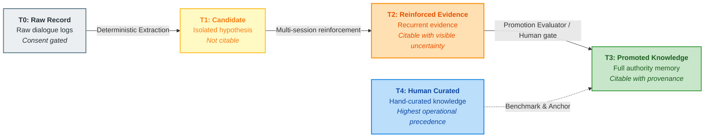
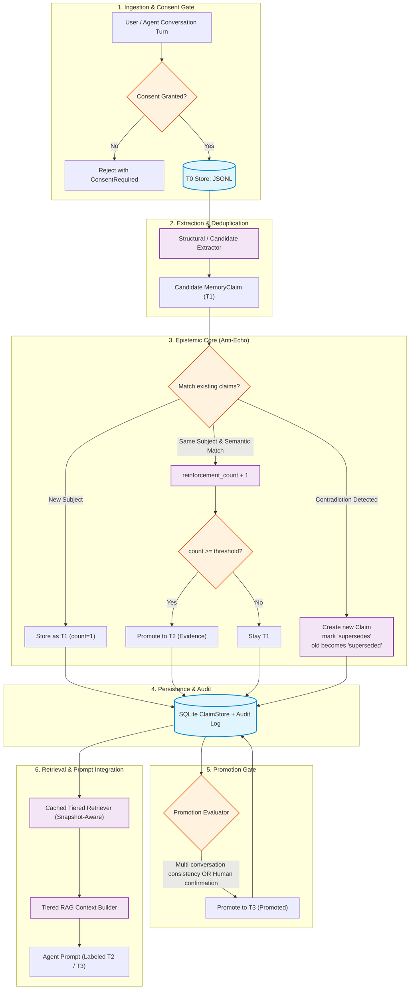
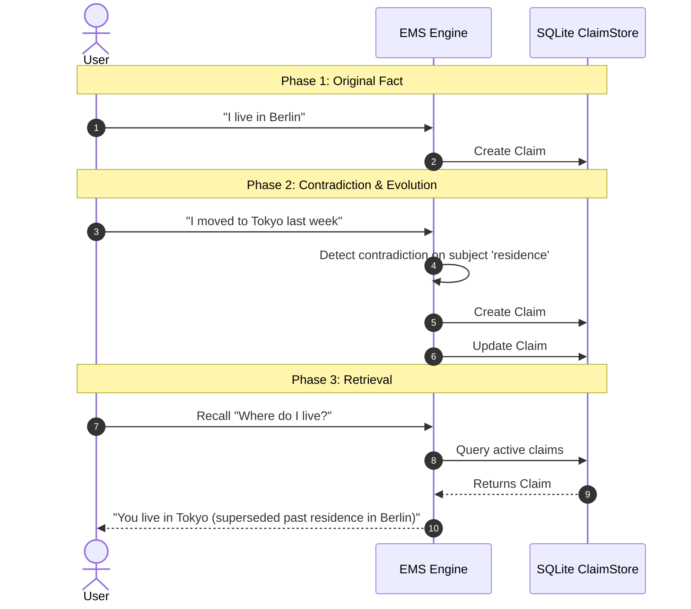
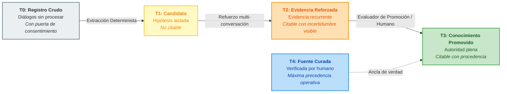
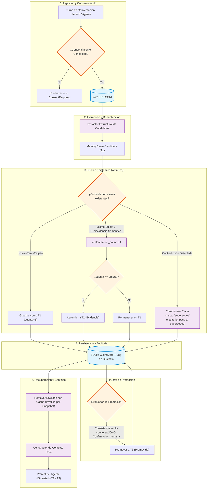
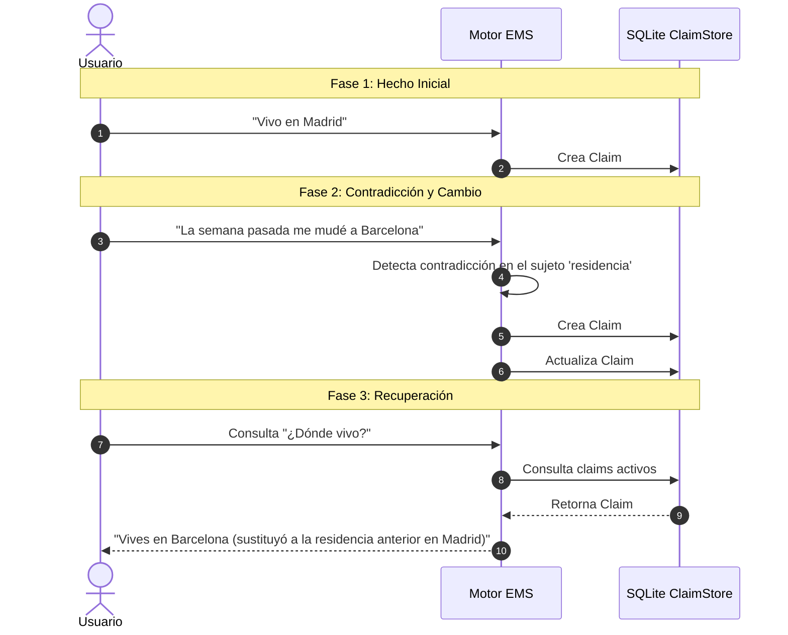

# EMS — Evidenced Memory System
# EMS — Sistema de Memoria Basada en Evidencia

[](https://www.python.org/downloads/)
[]()
[]()
[]()
[](LICENSE)

<div align="center">

### 🌐 Language / Idioma
**[ 🇬🇧 English Version ](#-english-version)** &nbsp; • &nbsp; **[ 🇪🇸 Versión en Español ](#-versión-en-español)**

</div>

> **A provenance-first memory layer for AI agents.**  
> *Most agent memory systems store what was said. EMS stores what can be responsibly used.*  
> 
> **Una capa de memoria con procedencia verificable para agentes de IA.**  
> *La mayoría de sistemas de memoria guardan lo que se dijo. EMS guarda lo que un agente puede usar responsablemente.*

```text
Conversation (T0) → Extracted Candidate (T1) → Reinforced Evidence (T2) → Promoted Knowledge (T3)
Conversación (T0) → Candidata Extraída (T1) → Evidencia Reforzada (T2) → Conocimiento Promovido (T3)
```

---

# 🇬🇧 English Version

## 📑 Table of Contents (English)

- [The Core Problem](#the-core-problem)
- [Key Features & Guarantees](#key-features--guarantees)
- [Trust Tiers (T0 – T4)](#trust-tiers-t0--t4)
- [System Architecture](#system-architecture)
- [Anti-Echo & Succession Engine](#anti-echo--succession-engine)
- [Quick Start](#quick-start)
  - [Installation](#installation)
  - [Python API Example](#python-api-example)
  - [CLI Tool](#cli-tool)
- [Data Model (`MemoryClaim`)](#data-model-memoryclaim)
- [Documentation Index](#documentation-index)
- [Philosophy & Positioning](#philosophy--positioning)

---

## The Core Problem

Standard agent architectures suffer from **conversational echo loops**:
1. An unverified claim or hallucination is uttered during a dialogue.
2. The agent commits it directly to a vector store as an absolute truth.
3. In subsequent turns, the agent retrieves its own past output and treats it as external fact.
4. Over time, error amplifies, and knowledge corrupts.

**EMS breaks this loop.** In EMS, conversational input is treated strictly as raw material. Claims must earn epistemic trust through multi-session reinforcement, contradiction resolution, temporal validation, and explicit gate promotion before they can ever be cited as facts.

---

## Key Features & Guarantees

- 🏷️ **Tiered Trust (T0–T4)**: Strict separation between raw chat, extracted hypotheses, reinforced evidence, promoted knowledge, and human ground-truth.
- 🔗 **Provenance & Custody by Default**: Every claim maintains cryptographic-like lineage to its original conversation IDs and mutation events.
- 🔀 **Append-Only Succession (Anti-Echo)**: Contradictory statements never overwrite data silently; they create explicit `supersedes` / `superseded_by` relationships.
- ⏳ **Temporal Validity & Decay**: Knowledge that is not periodically reconfirmed decays in confidence over configurable half-lives.
- 🔒 **Consent-First & Privacy**: Zero egress by default. Processing conversation logs strictly requires user consent gates before touching disk.
- ⚡ **Local-First & Resilient**: Built on deterministic core logic, SQLite with WAL mode, JSONL source storage, and snapshot-invalidated cache retrievers. Zero required cloud dependencies.

---

## Trust Tiers (T0 – T4)



| Tier | Name | Nature | Can it be cited as fact? | Retrieval Context Presentation |
|:---:|:---|:---|:---:|:---|
| **T0** | **Raw Conversation** | Unprocessed dialogue stream with explicit user consent. | ❌ **No** | Excluded from RAG retrieval context. Raw input only. |
| **T1** | **Extracted Candidate** | Explicit statements extracted structurally. Single occurrence. | ❌ **No** | Under observation. Never cited to the agent. |
| **T2** | **Reinforced Evidence** | Candidate validated across multiple distinct sessions or explicit feedback. | ⚠️ **With Uncertainty** | Injected with explicit confidence badges (e.g. `[EVIDENCIA T2]`). |
| **T3** | **Promoted Knowledge** | Passed strict multi-session promotion evaluator or human approval. | ✅ **Yes** | Injected with full authority and origin hash. |
| **T4** | **Human Curated Source** | Verified enterprise documentation or human-edited truth. | ✅ **Highest Authority** | Always takes precedence in case of conflict. |

---

## System Architecture



---

## Anti-Echo & Succession Engine

When real-world facts change (e.g., *"I work at Company A"* followed weeks later by *"I resigned and joined Company B"*), standard vector memories blend both into confused embeddings. 

EMS enforces **Explicit Succession**:



> 💡 **Core Invariant**: Nothing is silently overwritten. History is append-only and fully auditable.

---

## Quick Start

### Installation

```bash
git clone https://github.com/YoxeLaunch/EMS-Evidenced-Memory-System.git
cd EMS-Evidenced-Memory-System
pip install -e .
```

### Python API Example

```python
from datetime import datetime, timezone
from embudo import Embudo
from memory.capture import Turn, Consent

# 1. Open local memory database (SQLite + JSONL)
with Embudo.open("agent_memory.db") as memory:
    now_iso = datetime.now(timezone.utc).isoformat()
    
    # 2. Register conversation turn with mandatory user consent
    user_consent = Consent(
        granted=True,
        scope="profile_and_preferences",
        user_id="user_123",
        timestamp=now_iso
    )
    
    record, claims = memory.register_conversation(
        turns=[
            Turn(speaker="user", text="I am severely allergic to penicillin.", timestamp=now_iso)
        ],
        agent_id="medical_assistant",
        user_id="user_123",
        consent=user_consent
    )
    
    print(f"Captured record ID: {record.id}")
    for c in claims:
        print(f"Extracted claim [{c.tier.value}]: {c.subject} -> {c.text}")

    # 3. Retrieve tiered context for LLM prompt
    context = memory.recall("penicillin allergy", agent_id="medical_assistant")
    
    # Inject directly into your LLM prompt
    print("\n--- LLM Prompt Block ---")
    print(context.as_prompt_block())
```

### CLI Tool

EMS provides an integrated CLI to inspect memory store health and custody metrics:

```bash
# View database statistics, active claims, and audit events
embudo stats agent_memory.db
```

Output:
```text
Embudo v0.2.0 — agent_memory.db
esquema: v2
claims activos: 14 (T1: 4, T2: 8, T3: 2)
estados: active: 14, superseded: 3, expired: 1
eventos de custodia: created: 18, reinforced: 9, superseded: 3, promoted: 2
conversaciones T0: 12
construcciones de índice: 4
```

---

## Data Model (`MemoryClaim`)

```python
@dataclass(frozen=True)
class MemoryClaim:
    id: str                        # Deterministic SHA-256 hash of (agent_id, subject, normalized_text)
    agent_id: str                  # Isolated namespace / agent identifier
    subject: str                   # Normalized topic or entity (for indexing and deduplication)
    text: str                      # Stored claim in normalized canonical form
    tier: Tier                     # T0 | T1 | T2 | T3
    confidence: float              # Tier-specific confidence score (0.0 to 1.0)
    source_conversation_ids: list  # Full provenance tracking back to T0 logs
    first_seen_at: str             # ISO timestamp of first capture
    last_reinforced_at: str        # ISO timestamp of latest reinforcement
    reinforcement_count: int       # Number of independent session confirmations
    supersedes: str | None         # ID of past claim invalidated by this one
    superseded_by: str | None      # ID of successor claim if invalidated
    decay_half_life_days: int      # Half-life duration before confidence decay
    status: ClaimStatus            # active | superseded | expired | rejected
```

---

## Documentation Index

Deep-dive into the design philosophy, mathematical models, and implementation logs:

- 📖 [**Vision and Architecture**](docs/00-VISION-Y-ARQUITECTURA.md): Epistemic design principles, anti-echo guarantees, and comparison with static wiki systems.
- ⚙️ [**Tiered Memory Technical Core**](docs/01-MEMORIA-NIVELADA.md): Mathematical formulations for reinforcement, decay half-life, and promotion criteria.
- 🧩 [**Modular Components**](docs/02-COMPONENTES-REUTILIZABLES.md): In-depth breakdown of RAG, providers, and storage layers.
- 🗺️ [**Project Roadmap**](docs/03-ROADMAP.md): Milestones, phases completed, and live production evaluation goals.
- 🤝 [**Collaboration & Directives**](COLABORACION.md): Architectural decisions log, invariant checkpoints, and design rationale.

---

## Philosophy & Positioning

> **"An LLM's confidence is never evidence."**  
> **"Contradictions create succession, not silent overwrites."**

EMS is not a chatbot memory plugin or a toy key-value cache. It is a **Memory Governance Layer for Autonomous Agents**: a deterministic bridge between chaotic dialogue, vector retrieval, curated knowledge, and lifelong agent learning.

<div align="right">
  <a href="#ems--evidenced-memory-system">⬆️ Back to Top / Volver arriba</a>
</div>

---
---

# 🇪🇸 Versión en Español

## 📑 Tabla de Contenidos (Español)

- [El Problema Central](#el-problema-central)
- [Características y Garantías Principales](#características-y-garantías-principales)
- [Niveles de Confianza (T0 – T4)](#niveles-de-confianza-t0--t4)
- [Arquitectura del Sistema](#arquitectura-del-sistema)
- [Motor Anti-Eco y Sucesión Temporal](#motor-anti-eco-y-sucesión-temporal)
- [Guía de Inicio Rápido](#guía-de-inicio-rápido)
  - [Instalación](#instalación-1)
  - [Ejemplo de Uso de la API en Python](#ejemplo-de-uso-de-la-api-en-python)
  - [Herramienta CLI](#herramienta-cli)
- [Modelo de Datos (`MemoryClaim`)](#modelo-de-datos-memoryclaim)
- [Índice de Documentación](#índice-de-documentación)
- [Filosofía y Posicionamiento](#filosofía-y-posicionamiento)

---

## El Problema Central

Las arquitecturas de memoria tradicionales para agentes sufren del fenómeno del **bucle de eco**:
1. Una afirmación no verificada o una alucinación surge durante una conversación.
2. El agente la guarda directamente en su base de datos vectorial como un hecho absoluto.
3. En interacciones posteriores, el agente recupera su propia declaración pasada y la trata como una verdad externa irrefutable.
4. Con el tiempo, el error se amplifica y el conocimiento del agente se corrompe.

**EMS elimina este bucle de raíz.** En EMS, lo conversado es tratado estrictamente como materia prima. Una afirmación debe ganarse la confianza epistémica mediante refuerzo entre múltiples sesiones independientes, resolución explícita de contradicciones, validación temporal de caducidad y filtros de promoción antes de poder ser citada como un hecho.

---

## Características y Garantías Principales

- 🏷️ **Confianza por Niveles (T0–T4)**: Separación estricta entre diálogo crudo, hipótesis extraídas, evidencia reforzada, conocimiento promovido y fuentes curadas por humanos.
- 🔗 **Procedencia y Custodia por Defecto**: Cada memoria mantiene trazabilidad completa e inmutable hacia las conversaciones de origen y sus eventos de custodia.
- 🔀 **Historial Append-Only (Diseño Anti-Eco)**: Las contradicciones nunca sobreescriben datos en silencio; crean relaciones explícitas de sucesión (`supersedes` / `superseded_by`).
- ⏳ **Validez Temporal y Caducidad**: El conocimiento que no se reconfirma con el tiempo pierde peso mediante vidas medias configurables.
- 🔒 **Consentimiento Obligatorio y Privacidad**: Denegación de salida de datos por defecto. El registro de diálogos exige consentimiento explícito del usuario antes de tocar disco.
- ⚡ **Local-First y Resiliente**: Núcleo determinista sobre SQLite (modo WAL) y almacenamiento JSONL, con índices cacheados e invalidados por snapshot. Cero dependencias forzadas de servicios en la nube.

---

## Niveles de Confianza (T0 – T4)



| Nivel | Nombre | Naturaleza | ¿Se puede citar como hecho? | Presentación en el Prompt del Agente |
|:---:|:---|:---|:---:|:---|
| **T0** | **Registro Crudo** | Flujo de diálogo sin procesar con consentimiento explícito. | ❌ **No** | Excluido de la recuperación RAG. Solo entrada de datos. |
| **T1** | **Candidata Extraída** | Afirmación extraída estructuralmente de una sola mención. | ❌ **No** | En observación. Nunca se inyecta como contexto citable. |
| **T2** | **Evidencia Reforzada** | Candidata validada en múltiples sesiones independientes. | ⚠️ **Con Incertidumbre** | Inyectada con etiquetas explícitas (ej. `[EVIDENCIA T2]`). |
| **T3** | **Conocimiento Promovido** | Superó el evaluador de consistencia o validación humana. | ✅ **Sí** | Inyectada con autoridad plena, hash y procedencia. |
| **T4** | **Fuente Curada por Humano** | Documentación oficial o verdad editada manualmente. | ✅ **Máxima Autoridad** | Siempre tiene precedencia ante cualquier conflicto. |

---

## Arquitectura del Sistema



---

## Motor Anti-Eco y Sucesión Temporal

Cuando la realidad cambia (por ejemplo: *"Trabajo en la Empresa A"* y semanas después *"Renuncié y ahora trabajo en la Empresa B"*), las bases vectoriales convencionales mezclan ambas afirmaciones generando confusión.

EMS implementa **Sucesión Explícita**:



> 💡 **Invariante Central**: Nada se sobreescribe en silencio. El historial es append-only y completamente auditable.

---

## Guía de Inicio Rápido

### Instalación

```bash
git clone https://github.com/YoxeLaunch/EMS-Evidenced-Memory-System.git
cd EMS-Evidenced-Memory-System
pip install -e .
```

### Ejemplo de Uso de la API en Python

```python
from datetime import datetime, timezone
from embudo import Embudo
from memory.capture import Turn, Consent

# 1. Abrir base de datos de memoria persistente (SQLite + JSONL)
with Embudo.open("memoria_agente.db") as memoria:
    ahora_iso = datetime.now(timezone.utc).isoformat()
    
    # 2. Registrar turno conversacional con consentimiento explícito obligatorio
    consentimiento_usuario = Consent(
        granted=True,
        scope="perfil_y_preferencias",
        user_id="usuario_123",
        timestamp=ahora_iso
    )
    
    registro, claims = memoria.register_conversation(
        turns=[
            Turn(speaker="user", text="Soy alérgico a la penicilina.", timestamp=ahora_iso)
        ],
        agent_id="asistente_medico",
        user_id="usuario_123",
        consent=consentimiento_usuario
    )
    
    print(f"ID de registro capturado: {registro.id}")
    for c in claims:
        print(f"Claim extraído [{c.tier.value}]: {c.subject} -> {c.text}")

    # 3. Recuperar contexto clasificado por nivel para el prompt del LLM
    contexto = memoria.recall("alergia a medicamentos", agent_id="asistente_medico")
    
    # Inyectar directamente en el prompt
    print("\n--- Bloque formateado para el Prompt ---")
    print(contexto.as_prompt_block())
```

### Herramienta CLI

EMS incluye una interfaz de línea de comandos para auditar el estado y salud de la memoria:

```bash
# Inspeccionar estadísticas, claims activos y eventos de custodia
embudo stats memoria_agente.db
```

Salida esperada:
```text
Embudo v0.2.0 — memoria_agente.db
esquema: v2
claims activos: 14 (T1: 4, T2: 8, T3: 2)
estados: active: 14, superseded: 3, expired: 1
eventos de custodia: created: 18, reinforced: 9, superseded: 3, promoted: 2
conversaciones T0: 12
construcciones de índice: 4
```

---

## Modelo de Datos (`MemoryClaim`)

```python
@dataclass(frozen=True)
class MemoryClaim:
    id: str                        # Hash SHA-256 determinista de (agent_id, subject, texto_normalizado)
    agent_id: str                  # Espacio de nombres / identificador del agente
    subject: str                   # Entidad o tema normalizado (para deduplicación e indexado)
    text: str                      # Afirmación almacenada en forma canónica normalizada
    tier: Tier                     # T0 | T1 | T2 | T3
    confidence: float              # Puntuación de confianza interna del nivel (0.0 a 1.0)
    source_conversation_ids: list  # Trazabilidad completa hacia los registros T0 originales
    first_seen_at: str             # Marca de tiempo ISO de la primera captura
    last_reinforced_at: str        # Marca de tiempo ISO del último refuerzo
    reinforcement_count: int       # Número de confirmaciones en sesiones independientes
    supersedes: str | None         # ID del claim histórico que este reemplaza
    superseded_by: str | None      # ID del claim sucesor si fue invalidado
    decay_half_life_days: int      # Vida media en días antes de iniciar pérdida de confianza
    status: ClaimStatus            # active | superseded | expired | rejected
```

---

## Índice de Documentación

Explora en profundidad la visión arquitectónica, modelos epistémicos y registros de diseño:

- 📖 [**Visión y Arquitectura**](docs/00-VISION-Y-ARQUITECTURA.md): Principios epistémicos, garantías anti-eco y comparación con sistemas de wiki estática.
- ⚙️ [**Memoria Nivelada — Núcleo Técnico**](docs/01-MEMORIA-NIVELADA.md): Fórmulas de refuerzo, vidas medias de caducidad y criterios de promoción.
- 🧩 [**Componentes Reutilizables y Modulares**](docs/02-COMPONENTES-REUTILIZABLES.md): Detalle técnico de las capas RAG, proveedores de modelos y persistencia.
- 🗺️ [**Roadmap del Proyecto**](docs/03-ROADMAP.md): Hitos, fases implementadas y criterios de validación en entornos reales.
- 🤝 [**Registro de Decisiones y Colaboración**](COLABORACION.md): Bitácora de decisiones arquitectónicas, puntos de control e invariantes de diseño.

---

## Filosofía y Posicionamiento

> **"La confianza de un LLM nunca es evidencia."**  
> **"Las contradicciones crean sucesión, no sobrescrituras silenciosas."**

EMS no es una simple función de memoria para chatbots ni una caché clave-valor ingenua. Es un **Sistema de Gobernanza de Memoria para Agentes de IA**: una capa estructurada y determinista entre el diálogo conversacional, la recuperación vectorial, el conocimiento curado y el aprendizaje continuo a largo plazo.

---

<div align="center">
  <sub>Construido con estándares epistémicos rigurosos para agentes que aprenden de la experiencia sin confundir repetición con verdad.</sub>
  <br/><br/>
  <a href="#ems--evidenced-memory-system">⬆️ Volver arriba / Back to Top</a>
</div>
